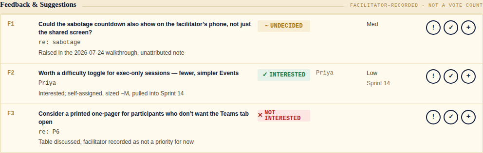
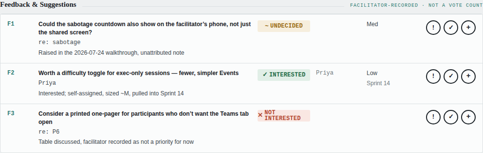
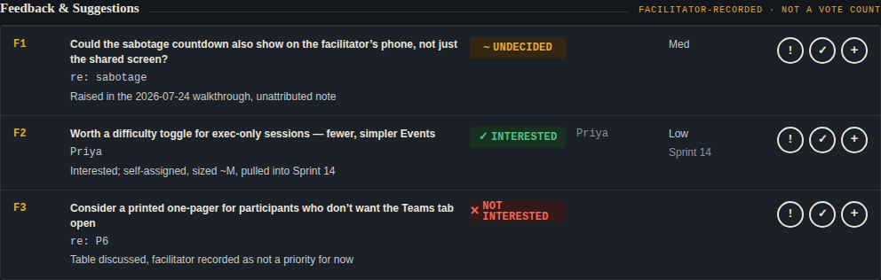
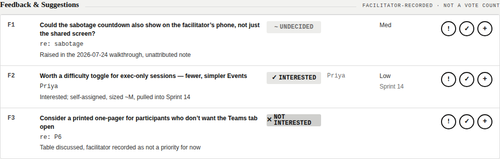
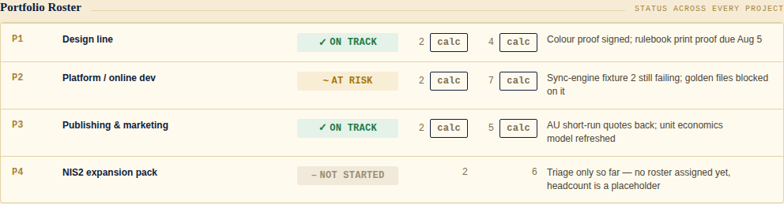

# project-skill-studio

A meta-skill for Claude that turns any project into a **skill studio**: a versioned suite of project-specific skills plus a tracking discipline, so work on a project is repeatable, canon-compliant, and resumable across sessions.

Generalised from a real production pattern (a card-game design studio that grew to 20+ skills across three classes). The pattern, not any one project, is what's encoded here.

## What it does

Point it at a project and it will:

- **Interview** the project (pulling from chat context, connected tools, and past sessions first — asking you only what it can't find)
- **Design a skill roster**: one canon skill (locked sources of truth), one build skill per *active* delivery line, plus studio-ops skills (tracker, QA, etc.) — never speculative skills for platforms that aren't real yet
- **Author and package** each skill as a `.skill` file, using Anthropic's `skill-creator`
- **Scaffold trackers**: `SESSION_STATE.md`, one tracker JSON per delivery line, a decision log, and **a set of three dashboards** over them — Skill builder, Facilitator, Resources — then ask, per surface, whether you want any of them hosted as live artifacts (files by default; hosting is a real choice, not an assumption)
- **Bake in working rules** into every generated skill: canon discipline, decision logging, evidence baselines that flag a tracker describing a build it no longer matches, modular re-authoring instead of rebuilds, proof gates on visual output, defensive tool-connection checks

## Install

### Claude.ai
Settings → Capabilities → Skills → Upload → select `project-skill-studio.skill` (built via `skill-creator`'s `package_skill.py`, or download the release asset from this repo).

### Claude Code
Copy this folder into your skills directory:
```bash
cp -r project-skill-studio ~/.claude/skills/
# or, for a single repo:
cp -r project-skill-studio /path/to/repo/.claude/skills/
```

Follows the open [Agent Skills](https://www.anthropic.com/news/skills) format — portable to any tool that adopts the standard.

## Use

Just describe your project and ask for a skill studio:

> "Run project skill studio on my [project name] — [one-line description]."

It will interview you (short selection prompts, not an essay), propose a roster for your confirmation, then build and package the suite.

If you already have a studio pattern from another project, say so — it will search for and carry over conventions explicitly rather than starting from scratch.

## Sample dashboards

A run emits three surfaces — **Skill builder**, **Facilitator** and **Resources**
([`references/dashboard-set.md`](references/dashboard-set.md)). The samples below are the
full tracker shell, which the Skill builder uses; the other two are pooled derived views
over the same trackers — as of v3.4 fully interactive (action trio, CREATE PROMPT, REFRESH
DATA, scheme switcher) plus a click-to-scope index and dropdown/search filtering unique to a pooled
surface — and bound by the same honesty rules as the shell throughout.

Every dashboard the studio emits conforms to [`references/DASHBOARD_SPEC.md`](references/DASHBOARD_SPEC.md)
(v3.4) — that file is the authority, not this README. Full worked samples, screenshots,
and a regeneration script live in [`docs/samples/`](docs/samples); a ready-to-paste wiki
page with the same material is in [`docs/wiki/`](docs/wiki).

These are real screenshots of the actual [`references/dashboard-reference.html`](references/dashboard-reference.html)
running its real code, in each of its four real schemes — not a separate mockup generator.
An earlier SVG-based generator was retired for exactly that reason: it had its own scheme
names that had already drifted from the reference build's real ones.

**Feedback & Suggestions, across all four schemes** — a facilitator-recorded capture
surface for live reviews, not a vote count:



| Slate | Dark | Mono |
|---|---|---|
|  |  |  |

**Resource Tracker — a third archetype, same shell.** Portfolio-level status across every
project, not one line's build detail — two more sections, same file:



What the samples demonstrate:

- **Status marks** as glyph + word + tint — `✓ PASS`, `✕ FAIL`, `~ PEND`, `■ BLOCK`,
  `– N/A` — never colour alone, so they survive greyscale and colour-blind reading.
- **Two independent axes**, always. Build state (`INTEGRATED / TESTED / BUILDING /
  PROTOTYPE`) is separate from the six per-check marks (`TYP UNI GLD MUL SEC PII`) on a
  module row; project status is separate from a person's task count on a portfolio row.
  A row can read TESTED while its checks still say PEND — that's the reason the axes split.
- **Evidence beside every claim.** "golden files vs matrix: 2/3 tiers reproduce" rather
  than a bare status. Absent evidence, an item is pending, not pass.
- **A baseline, so freshness can't lie.** The tracker records the version its marks were
  derived from next to the version now shipping. When they diverge, every pass goes
  provisional and says why — otherwise a file rewritten this morning about a three-version-old
  build shows green on every signal it has.
- **Derived, never stored.** A person's task total, a project's people/task count when a
  roster exists — computed at render from the underlying rows, never a separately typed
  number that can drift from what it's supposed to describe.
- **The trio on every actionable row** — `!` explain, `✓` proceed, `+` improve. Untouched
  rows stay pending; there is no HOLD. Feedback rows carry one additional, deliberately
  exceptional control: a clickable interest mark — the only status chip on the whole page
  that isn't evidence-derived and read-only.
- **The sync contract stated in the UI**: Claude cannot see edits made in the page, so
  marks are compiled by CREATE PROMPT and pasted back into chat.

Regenerate with `python3 docs/samples/shoot.py` (Playwright; screenshots the real
reference build, four schemes) from the `docs/samples/` directory.

## Structure

```
project-skill-studio/
├── SKILL.md                              # main workflow
├── references/
│   ├── intake.md                         # intake question set
│   ├── session-state-template.md         # SESSION_STATE.md template
│   ├── memory-tiers.md                   # SESSION_STATE.md + optional 2nd/3rd tier, precedence rule
│   ├── tracker-schema.md                 # per-line tracker JSON schemas + evidence baseline
│   ├── dashboard-set.md                  # the three surfaces + the live-artifact consent step
│   ├── generated-skill-template.md       # skeleton every generated skill follows
│   ├── working-rules.md                  # working-rule set embedded in generated skills
│   ├── skill-baseline.md                 # work loop, MCP-first rule, new-skill checklist
│   ├── canon-first-workflow.md           # search-canon-first sequence for generation requests
│   ├── DASHBOARD_SPEC.md                 # the dashboard authority (v3.4)
│   ├── dashboard-reference.html          # working live-fetch reference build — copy this
│   ├── facilitator-hub-reference.html    # working build for Facilitator/Resources — copy this
│   ├── dashboard-standard.md             # pointer: what v3.0 changed from the retired v1.0 rules
│   └── dashboard-sample-generator.py     # regenerates the four scheme mockups + contrast table
└── docs/
    ├── wiki/
    │   └── Tracker-Shell-Samples.md      # ready to paste into a GitHub wiki
    └── samples/
        ├── shoot.py                       # Playwright screenshots of the real reference build
        ├── screenshots/                   # Feedback & Suggestions, all four schemes
        └── resource-tracker/              # full worked Resource Tracker example (JSON + HTML)
```

## Requires

- Anthropic's `skill-creator` skill (for authoring/packaging test cases and `.skill` files) — install it alongside this one.

## License

[CC0-1.0](LICENSE) — public domain dedication. Use it, fork it, adapt it, no attribution required.

## Changelog

See [CHANGELOG.md](CHANGELOG.md).
