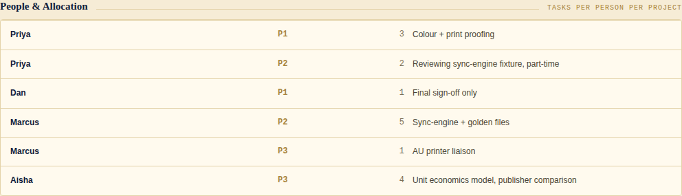

# Tracker Shell samples

Live screenshots of `references/dashboard-reference.html` — the actual shipped reference
build, in each of its four real colour schemes. These are not a separate mockup generator;
they're Chromium screenshots of the real file running its real code, so what you see here
is exactly what copying the reference gives you.

Generated against **v1.7.0**, which added [§4e Feedback & Suggestions](https://github.com/jdonlinestuff-ui/project-skill-studio/blob/main/references/DASHBOARD_SPEC.md#4e-feedback--suggestions--a-facilitator-dashboard-not-a-voting-app) — a facilitator-recorded capture surface for live reviews. No vote tally: a status a person sets once (`~ UNDECIDED` / `✓ INTERESTED` / `✕ NOT INTERESTED`), the **one deliberately clickable chip** in the whole dashboard. Every other status mark on the page is evidence-derived and read-only; this is the stated, single exception.

## Full dashboard — Canon scheme (default)


## Feedback & Suggestions section, across all four schemes

The same section, same data, same layout — only the scheme token table changes. Click
through these to see how little should ever differ between schemes: text, spacing, and
component geometry stay fixed; only `bg` / `panel` / `text` / `muted` / `line` / `accent`
and the five mark colours move.

### Canon (default)


### Slate


### Dark


### Mono


## Also works for sprint planning — no schema change

`timeline` is free text with zero date parsing in the code, so a row can hold `"Sprint 14"`
exactly as it holds a literal date. `priority` stays priority, not size, on purpose — and
the interest mark stays a stakeholder reaction, not a planner's sprint commitment, since
those are often different people making different decisions at different times. See
[`DASHBOARD_SPEC.md` §4e](https://github.com/jdonlinestuff-ui/project-skill-studio/blob/main/references/DASHBOARD_SPEC.md#4e-feedback--suggestions--a-facilitator-dashboard-not-a-voting-app)
for what this deliberately does *not* give you (capacity, velocity, burndown).

## What to notice

- **Two axes, never conflated.** Build-state badges (`INTEGRATED`/`TESTED`/`BUILDING`/`PROTOTYPE`) sit apart from the six per-check marks — a module can read `TESTED` while individual checks still show `~ PEND`.
- **Evidence beside every claim.** No bare status without a note saying what was actually run.
- **The trio, unchanged everywhere.** `!` EXPLAIN · `✓` PROCEED · `+` IMPROVE mean the same thing on every row, including feedback rows — the interested/undecided/not-interested mark is a *separate* control precisely so the trio's meaning never gets overloaded per-section.
- **Optional attribution.** `raisedBy` and `owner` are free text with no login — built for a facilitator transcribing for a room as often as for named individual input.


## Resource Tracker — a third archetype, same shell

Portfolio-level status across every project, not one line's build detail. Same file, same
CSS, same marks — two new sections ([§4f/§4g](https://github.com/jdonlinestuff-ui/project-skill-studio/blob/main/references/DASHBOARD_SPEC.md#4f-portfolio-roster--status-across-every-project-not-one-lines-detail)),
everything else absent for this instance. This is what "swap the DATA block, not the shell" was built for.


Four projects, two derive-modes shown side by side on purpose: **P1–P3 are derived** —
[People & Allocation](../samples/resource-tracker/resource_people.png) has rows for them,
so their people/task counts are summed at render (the `calc` tag marks this) — while
**P4 is recorded directly** on its own row, because no roster exists for it yet. A tracker
instance picks one mode per project; mixing both for the *same* project would mean two
numbers claiming to describe one fact, which is exactly the drift this spec exists to rule
out.



Marcus appears on two projects (P2: 5 tasks, P3: 1 task) with no grand total stored
anywhere — only per-project rows. That's deliberate: a person's total is derivable at any
time by summing their rows: it should never itself be a fact someone has to remember to
update.

Full worked example, JSON + working HTML instance, in [`docs/samples/resource-tracker/`](https://github.com/jdonlinestuff-ui/project-skill-studio/tree/main/docs/samples/resource-tracker).

## Regenerating these

```bash
python3 docs/samples/shoot.py
```

Uses Playwright against the real `references/dashboard-reference.html` — no parallel mockup system to keep in sync. See [`CHANGELOG.md`](https://github.com/jdonlinestuff-ui/project-skill-studio/blob/main/CHANGELOG.md) for why the previous SVG-based mockup generator was retired: it used its own scheme names (Ink/Parchment/Mono print/Dark console) that had already drifted from the reference build's real four schemes (Canon/Slate/Dark/Mono) by the time §4e shipped.
